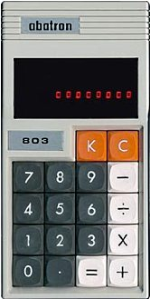

# calculator-design

Design of the Abatron 803 calculator in css. I thought the calculator was really pretty, so wanted to recreate the design in HTML/CSS.

It's not functional at this point, but I might add some JavaScript to make it work like a real calculator as well.

**The result**

**Important to note**
I thought the image I found was of a real calculator, so I replicating its design entirely in CSS. But as it turns out, after finishing the project I found out it was actually a design made by someone on Dribble, so I need to give credit here: (https://dribbble.com/shots/499001-Abatron-Calculator-Buttons).

However, that design based on (and almost the same as) a real calculator from 1976, the Abatron 803: https://www.calculator.org/calculators/Abatron_803.html

**The original**

